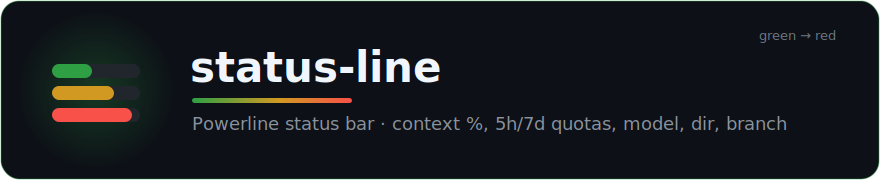
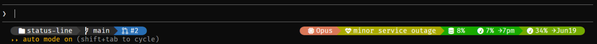

<div align="center">



### A single **powerline strip** of live indicators for Claude Code.

Context window, 5h / 7d rate-limit quotas, model, directory, git branch and service status — color-coded green→red, rounded caps, filled chevrons. **Additive** (it never replaces your existing status line) and **single-process** (just `node`).

[](./.claude-plugin/plugin.json)
[](https://docs.claude.com/en/docs/claude-code)
[](https://nodejs.org)
[](./LICENSE)

```sh
/plugin marketplace add yoannyviquel/marketplace
/plugin install status-line
/install-statusline
```

</div>

---

## 🎨 What it looks like

<p align="center"></p>

Left to right: `dir` and `branch`, the session's `pr` (clickable), then right-aligned after `gap` — `model`, a `status` incident badge (`minor service outage`), and the `ctx` / `5h` / `7d` gauges with their dynamic reset times.

Each gauge shows `NN%` and is tinted by its level (green = low, red = high). The `5h` / `7d` labels are the **dynamic reset time** reported by Claude Code (`→1am` same-day, `→Jun12` otherwise), falling back to `→5h` / `→7j`. `model` / `dir` / `branch` use solid backgrounds with white text. `status` only appears during a service incident.

## ✨ Segments

The displayed segments are an **ordered list** in `~/.claude/gradient-statusline.config.json` — order = display order, presence = enabled. Absent data (no quota, no git repo) drops its segment automatically.

| Segment | Shows | Style |
|---|---|---|
| `ctx` | Context-window usage `NN%` | gauge, green→red by % |
| `5h` | 5h rate-limit quota + dynamic reset | gauge, green→red |
| `7d` | 7d rate-limit quota + dynamic reset | gauge, green→red |
| `model` | Current model name | microchip glyph, Claude clay/orange bg |
| `dir` | Current directory name | folder glyph, solid bg |
| `branch` | Current git branch (omitted outside a repo) | branch glyph, solid bg |
| `status` | [status.claude.com](https://status.claude.com/) heartbeat + label — **only during an incident**, clickable | colored, hidden when operational |
| `pr` | The session's pull requests as `<COMPONENT> #<n>` (component = repo acronym), clickable, wrapping onto extra rows | inline list |
| `gap` | Splitter — everything after it is right-aligned to the window edge | — |

> **Separators** are decided per segment *family*: same-family gauges (`ctx`/`5h`/`7d`) flow into each other via a colored chevron, location segments (`model`/`dir`/`branch`) merge the same way, and two differing families are split by a black band. These rules live in the `FAMILY` trait table in `scripts/statusline.js`.

## 📦 Requirements

- A **truecolor** (24-bit) terminal.
- `node` on `PATH`.
- A **Nerd Font** for the powerline glyphs (caps, chevrons, folder/branch icons) — without one they show as tofu boxes. Grab one at <https://www.nerdfonts.com/> and set it as your terminal font.

## 🚀 Install

1. Add the plugin (via the marketplace) and enable it:
   ```text
   /plugin marketplace add yoannyviquel/marketplace
   /plugin install status-line
   ```
2. Run **once**:
   ```text
   /install-statusline
   ```
   It copies `statusline.js` to `~/.claude/gradient-statusline.js` and points `statusLine` in your `~/.claude/settings.json` at it. Any existing config is backed up to `settings.json.bak`, and a previously configured status line is **preserved as a prefix** (additive). A fresh install enables all elements.
3. Restart Claude Code (or open a new session).

The installed script lives at `~/.claude/gradient-statusline.js` — independent of the plugin, so it keeps working if the plugin is later updated or removed.

> **Updates are automatic.** A `SessionStart` hook (`scripts/deploy.js`) re-copies the script on each session start whenever an install already exists and the source changed — so a plugin update reaches you without re-running `/install-statusline`. It never creates an install and never writes when nothing changed.

## 🎛️ Configure

Use the interactive command (no restart needed — the config is re-read on every refresh):

```text
/statusline-mode
```

…or pass elements directly (order = display order):

```text
/statusline-mode ctx 5h dir branch
```

Running with no argument prints the current configuration.

<details>
<summary><b>Why a command, and not automatic?</b></summary>

Claude Code plugins **cannot** set the main `statusLine` directly (plugin `settings.json` only supports `agent` / `subagentStatusLine`). So this plugin ships a one-shot installer instead of patching your settings silently.

</details>

<details>
<summary><b>Tweak the look</b></summary>

Constants at the top of `scripts/statusline.js`:

- `GLYPH` — folder / branch / model icons and the powerline caps & chevron.
- `LABELS` — gauge labels (`ctx`, `→5h`, `→7j`).
- `GAUGE_FG` — gauge text color; `SEG` — `model` / `dir` / `branch` segment colors.
- `FAMILY` — per-family separator style (`merge` / `band`) and `mergeNext`.
- `grad`'s `m=170` — color brightness ceiling (lower = darker).

> `~/.claude/gradient-statusline.js` is a copy: it is overwritten on reinstall and re-synced from the source on every session start. To persist changes, edit the source `scripts/statusline.js` — the next session redeploys it automatically.

</details>

<details>
<summary><b>Tests & uninstall</b></summary>

### Tests

End-to-end tests (zero dependency — just `node`) cover element on/off combinations, the per-family separators, rounded caps, right-align via `gap`, and graceful drops (missing data, non-git, legacy config):

```text
node tests/e2e.js      # or: npm test
```

### Uninstall

Remove the `statusLine` block from `~/.claude/settings.json` (or restore `settings.json.bak`) and delete `~/.claude/gradient-statusline.js`.

</details>

---

<div align="center">

MIT © Yoann Yviquel · Part of the [**yoannyviquel** marketplace](https://github.com/yoannyviquel/marketplace)

</div>
